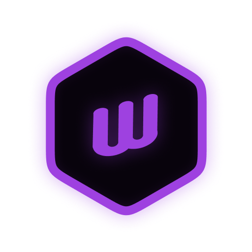
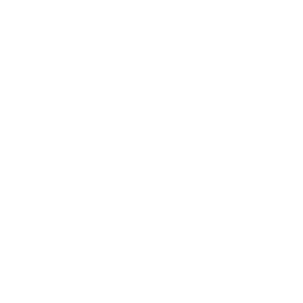

<div align="center">




### Owlang 

</div>

Owlang is a new programming language designed to be simpler than Python, yet as powerful as Rust.
This repository contains the compiler (`owc`), package manager (`owm`), and developer tooling (formatter, linter, LSP).

The language features a clean and intuitive syntax, allowing users to focus on problem-solving rather than getting bogged down by complex language rules. With a strong emphasis on educational use, OwLang provides a gentle introduction to programming while still being powerful enough for more advanced projects.

> ⚠️ Experimental — Owlang is in active early development.
>
> Owlang is in its early experimental phase. Expect rapid iterations and breaking changes.

## 📖 Documentation

- [Getting Started](docs/getting_started.md)
- [Architecture Overview](docs/architecture.md)
- [Compiler Pipeline](docs/compiler_pipeline.md)
- [Contributing Guide](docs/contrib/contributing.md)
- [Roadmap](docs/roadmap.md)

---

<details>
  <summary>📂 Repository Structure</summary>

```bash
owlang/
├── src/
│   ├── owc/            # CLI compiler
│   ├── owlib/          # Core compiler library
│   ├── owm/            # Package & project manager
│   ├── lexer/          # Lexical analyzer
│   ├── parser/         # Parser → builds the AST
│   ├── semantic/       # Semantic analysis
│   ├── codegen/        # Code generation
│   └── tools/
│       ├── formatter/  # Code formatter
│       └── linter/     # Linter
├── tooling/lsp/        # Language Server Protocol support
├── examples/           # Example projects
├── docs/               # Documentation
└── scripts/            # Dev & CI helper scripts
```

</details>

<details>
  <summary>🛠️ Toolchain Setup</summary>

#### Requirements

- [Rust](https://www.rust-lang.org/tools/install) (1.89.0+)
- [Cargo](https://doc.rust-lang.org/cargo/getting-started/installation.html) (1.89.0+)

#### Bootstrap environment

```bash
# Linux/macOS
./scripts/bootstrap.sh

# Windows (PowerShell)
./scripts/bootstrap.ps1
```

#### Usage

Compile and run the compiler with:

```bash
cargo run --bin owc -- --file examples/hello.ow
```

> Where `hello.ow` is a source file in Owlang.

</details>

<details>
  <summary>Others</summary>

#### 📦 Package Manager (owm)

Owlang will ship with a package manager called `owm`. This tool will help you manage your Owlang projects and dependencies.

```bash
cargo run --bin owm
```

#### ✅ Development Workflow

- Format code with `cargo fmt --all`
- Run tests with `cargo test --all`
- Lint with Clippy: `cargo clippy --all -- -D warnings`

## </details>

---

### 📜 License

Owlang is currently licensed under [MIT License](#LICENSE.md)
> ⚠️ The license may change before the 1.0 release.
